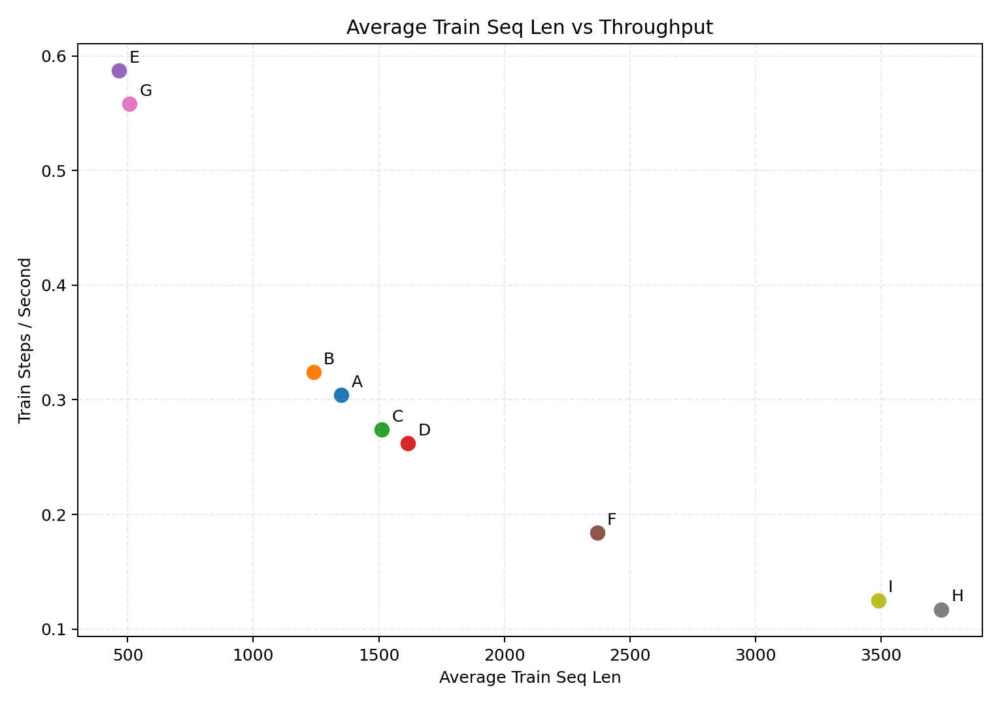
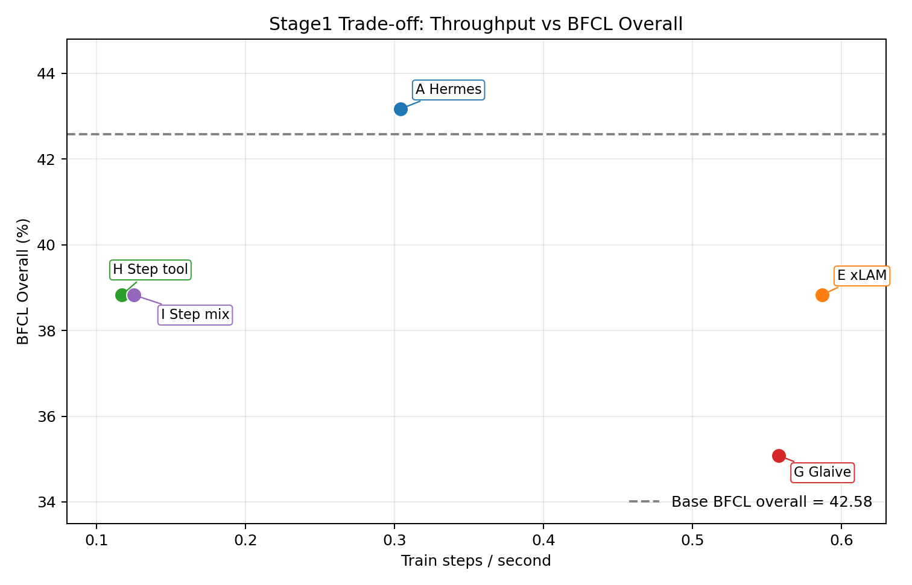
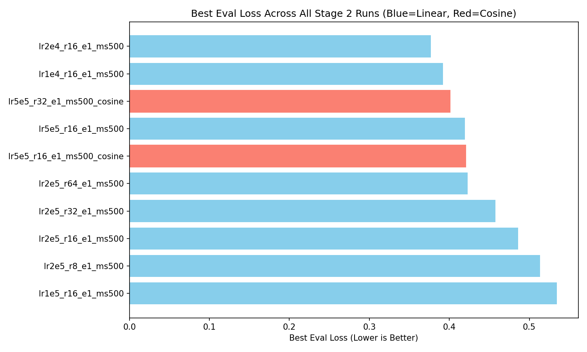
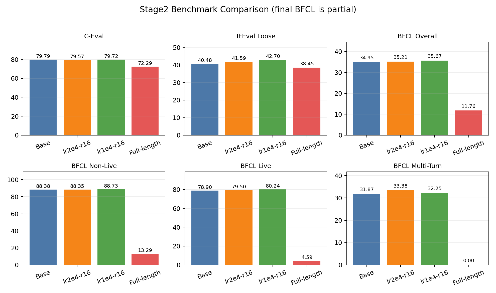

# Qwen3 Tool Calling 项目报告

## 1. 项目背景

本项目围绕 `Qwen/Qwen3-8B` 做后训练，目标不是单纯把模型“训得更像工具调用模型”，而是尽量同时保住三类能力：

1. 基础知识与推理能力
2. 指令遵循与格式约束
3. 多轮、带工具、带状态的 agentic 行为

因此，整个项目的核心问题其实是一个平衡问题：**如何在增强 tool calling 的同时，不把原生模型的通用能力拉坏**。  
本仓库的评测主线也始终围绕这三类目标展开，主要用 `C-Eval`、`IFEval`、`BFCL v4` 来判断模型是否真的在“可用的 agent 能力”上变强，而不是只在训练损失上变好。

从当前结论看，项目最终已经收敛到两个重要节点：

- 最终可采用的短训胜者是 `stage2_best_lr1e4_r16`
- full-length 正式训练 `stage2train_20260408_095122_stage2_qwen3_8b_lora` 则应视为失败案例

这意味着本项目不是一个“持续堆更长训练就更好”的故事，而是一个**通过数据调研、数据消融和短训搜索，找到有效干预点后，又用 full-length 训练验证其边界**的故事。

## 2. 数据集调研与选择理由

在真正做 stage1 消融之前，仓库已经先做了数据源层面的调研。这里的目标不是找“最大数据集”，而是找**最适合 Qwen3-8B 做 tool calling 后训练的监督信号组合**。

### 2.1 备选数据源及预期作用

| 数据源 | 预期角色 | 选择理由 | 风险 / 代价 |
| --- | --- | --- | --- |
| Hermes Reasoning Tool Use | 主干 multi-turn tool calling | 与 BFCL / Atropos RL 风格更接近，结构稳，质量高 | 覆盖面不算最大 |
| xLAM Function Calling 60K | 简单单轮函数调用补充 | 格式整齐，易优化，适合补“短、稳、清楚”的调用 | 容易把训练重心拉向简单分布 |
| Qwen3.5 ToolCalling v2 | 对照线 | 介绍是针对 qwen 系列模式，格式已经调整好 | 社区拼接，未严格清洗 |
| Glaive Function Calling v2 | 历史对照线 | 经典 baseline，便于比较 | 风格偏旧，转换成本高 |
| Step-3.5-Flash-SFT general | 通用 rehearsal | 补通用表达，防止只向工具调用分布过拟合 | 序列更长，成本更高 |
| Step-3.5-Flash-SFT tool-call | 长轨迹 / agentic 补充 | 覆盖长上下文、多轮和工具密集场景 | 噪声更高，不能放太大比例 |

这里的 `step` 指的是 **StepFun 开源的用于真实商业级大模型 Step-3.5-Flash-SFT 后训练的 SFT 数据集 `Step-3.5-Flash-SFT`**。  
它在本项目里不是“普通的通用文本数据”，而是专门承担以下两类补位：

- `step tool-call`：抽取其中 tool-call 类的数据，补长轨迹、agentic、多轮工具调用
- `step general`：抽取非 tool-call 的数据，补通用 rehearsal，避免模型只朝工具调用分布偏移

### 2.2 调研阶段的预期

在 stage1 之前，比较合理的预期是：

- Hermes 作为主干，应该是最稳的通用 tool calling 来源
- xLAM / Glaive 这类格式整齐、短样本多的数据，可能让训练 loss 更好看，但未必真正提升外部 benchmark
- Step tool-call 可能对长轨迹和 agent 场景更有帮助，但会明显增加序列长度和训练成本
- Step general 主要是抗遗忘和分布平衡，不应该成为主混合的大头

这些判断后来基本被 stage1 的结果部分证实，也部分推翻：

- 证实：Hermes 仍然是最稳的主干
- 证实：xLAM/Glaive 的训练损失更容易优化，但不等于外部 benchmark 更强
- 证实：Step 数据确实带来更长序列和更高成本
- 推翻：Step 数据并不天然比 Hermes 更“直接有效”，至少不能单独放大成主干

## 3. 方法

### 3.1 数据来源与处理

项目中的数据统一处理成 `messages + tools` 结构，并尽量对齐 Qwen3 的 chat template。

主要规则如下：

- Hermes / Step / Qwen3.5 系列的工具定义默认放在 system prompt 中，`tools = null`
- xLAM 保留顶层 `tools`
- assistant 回复里的 reasoning 内容统一包成 `<think> ... </think>`
- 删除 `<think>` 开闭不平衡样本
- 删除不是以 assistant 收尾的样本
- 对所有 assistant 回复补齐空的 `<think>` 前缀
- 训练时保留 `<think>` 标签本身的监督，只 mask `think` 内部内容

这一套处理逻辑的关键点是：**模型需要学会“thinking mode”的外壳和输出格式，但不必机械模仿异源数据的具体推理文本**。  
这样做的目的，是尽量保留 Qwen3 的思维模式触发语义，同时避免把异源 reasoning 内容当成必须复述的目标。

### 3.2 Step 数据的抽取方式

`Step-3.5-Flash-SFT` 在本项目里被拆成两个不同角色：

- `step tool-call`
  - 从包含 schema / `tool_calls` / `tool_call_id` / tool role 的轨迹里提取
  - 用于增强 agentic 和多轮工具调用
- `step general`
  - 仅保留没有 tool role、没有 tool_calls、没有 tool_call_id、没有 tools 字段的对话
  - 再按 Qwen3 token 长度过滤后抽样

其中 `step general` 的构造不是简单“随便抽样”，而是先固定历史 shard baseline，再做长度过滤和全局采样。  
这件事很重要，因为它意味着这不是一个任意扩容的数据集，而是一个**为了控制成本和分布偏移而设计的受控采样**。

### 3.3 训练配置

stage1 与 stage2 search 都采用 LoRA 微调，核心配置是一致的：

- `Qwen/Qwen3-8B`
- `bf16`
- `LoRA r=16`
- `target_modules = q_proj, k_proj, v_proj, o_proj, gate_proj, up_proj, down_proj`
- `packing = false`
- `max_seq_length = 8192`
- `optim = adamw_8bit`
- `gradient_accumulation_steps = 16`

分阶段设计如下：

| 阶段 | 数据 | 训练设定 | 目的 |
| --- | --- | --- | --- |
| stage1 | 5k / 1 epoch | `lr=2e-5`, `r=16`, 重点看训练和外部 benchmark | 数据消融 |
| stage2 search | 10k frozen mix / 500 steps | 搜索 `lr` 和 `r` 组合 | 找到短训最优点 |
| stage2 final | 60k frozen mix / 1 epoch | `lr=1e-4`, `r=16`，正式 full-length | 验证是否能稳定放大 |

stage1 的意义不是“找绝对最强模型”，而是先判断**什么样的数据配方方向是对的**。  
stage2 search 则是在固定数据配方后，找一个最适合后续收敛的短训超参。  
full-length 正式训练本来是要验证“短训信号能否继续扩大”，但最终事实证明：**不能简单线性外推**。

## 4. 实验与结果

### 4.1 Stage1：数据消融与预期对照

stage1 的关键不是单个分数，而是“训练难易度”和“外部 benchmark”是否一致。

这里需要特别说明，stage1 的各评测框架都只做了 50 条左右的快速抽样评测，`C-Eval` 则是按每个子类最多抽 50 条来跑。  
因此，这里的分数更适合看**相对趋势**，不能作为唯一判断指标；同一配置在 rerun 前后也会出现一定波动，尤其是样本较少时更明显。

下面挑几组最有代表性的结果：

| 组别 | 配方 | 平均序列长度 | 训练步速 | eval_loss | C-Eval | IFEval Strict | IFEval Loose | BFCL Overall | BFCL Live | BFCL Multi-Turn |
| --- | --- | ---: | ---: | ---: | ---: | ---: | ---: | ---: | ---: | ---: |
| base | Qwen3-8B 原模型 | - | - | - | 79.79% | 34.00% | 42.00% | 42.58% | 80.00% | 50.00% |
| A | Hermes only | 1351.46 | 0.304 | 0.4943 | 79.79% | 34.00% | 40.00% | 43.17% | 90.00% | 50.00% |
| E | xLAM only | 465.68 | 0.587 | 0.0304 | 79.64% | 36.00% | 44.00% | 38.83% | 80.00% | 37.50% |
| G | Glaive FC v2 only | 507.79 | 0.558 | 0.3389 | 79.49% | 36.00% | 44.00% | 35.08% | 80.00% | 25.00% |
| H | Step tool-call only | 3740.20 | 0.117 | 0.4169 | 79.87% | 36.00% | 42.00% | 38.83% | 80.00% | 37.50% |
| I | Step tool-call + Step general (4:1) | 3489.42 | 0.125 | 0.4891 | 79.64% | 36.00% | 44.00% | 38.83% | 80.00% | 37.50% |

注：`base` 和 `H` 的 `C-Eval / IFEval / BFCL` 采用 rerun 结果；`H` 的平均序列长度、训练步速和 `eval_loss` 仍对应原始训练日志，因为 rerun 只重新执行了 benchmark。

从数据工程角度看，stage1 的成本差异其实非常大。Step-heavy 配方把平均序列长度推到 `3.5k+ token`，训练吞吐明显下降；Hermes 处在更容易承受的中间带，而 xLAM / Glaive 虽然更短更快，但后续 benchmark 并没有因此占优。



*图 1. 已有曲线展示了 stage1 不同配方的平均序列长度与训练步速关系。Step 配方最重，xLAM / Glaive 最轻，Hermes 位于中间。*

如果把训练成本和 BFCL Overall 放到同一张图里，stage1 的取舍会更直观：



*图 2. 训练吞吐与 BFCL Overall 的关系。Hermes 不是最快，但在代表性组里是最稳的主干；Step 配方成本最高，xLAM / Glaive 则呈现“快但外部收益有限”的特点。*

#### 4.1.1 分项解读

从这组抽样结果看，stage1 更像是在回答“哪类数据适合做主干”，而不是“哪组数据能把所有指标一起拉满”。

- `C-Eval` 基本都落在 `79.49%~79.87%` 之间，变化幅度很小，说明 stage1 的短训主要在修正 tool-calling 行为和输出习惯，并没有明显破坏原生知识面。这一点很重要，因为它表明我们在做能力注入时，没有把模型推离 `Qwen3-8B` 原来的知识先验。
- `IFEval` 的变化比 `C-Eval` 更敏感。`xLAM` 明显更高，`Step` 配方在 `Strict` 上也有一定改善，但 `H` 的 rerun `Loose` 只回到 baseline 水平，说明这类数据对格式控制的帮助并不稳定。也就是说，它更像是在局部改善输出约束，而不是稳定提升整体指令遵循。
- `BFCL` 最能区分不同数据源的实际价值。`Hermes only` 的 `BFCL Overall` 略高于 baseline，同时 `BFCL Live` 明显更高，说明它是比较稳的主干信号；`xLAM only` 虽然 `eval_loss` 最低，但 `BFCL Overall` 和 `Multi-Turn` 都回落，说明训练损失在这里更像是在奖励“短、整齐、容易拟合”的样本分布，而不是完整的工具能力；`Step tool-call only` 在 rerun 后恢复到了 `38.83% / 37.50%`，比第一次快速评测更好，但考虑到它的序列长度和训练成本仍然最高，整体性价比依旧不如 Hermes，说明长轨迹数据更适合作为补充能力来源，而不是单独充当训练主干。
- `Glaive FC v2 only` 则是这轮比较里最典型的历史合成对照。它的训练配方短、快、容易拟合，但 BFCL Overall 只有 `35.08%`，`Multi-Turn` 也只有 `25.00%`，明显低于 baseline 和 Hermes。换句话说，没有严格清洗、重构和再对齐过的远古合成数据，很难在当前 tool-calling 目标上提供稳定增益，更多只是一个“能跑通但收益有限”的旧 baseline。

这组结果值得写进报告的点：

1. **xLAM-only 最容易把 loss 做漂亮**，但这种“漂亮”主要来自样本结构更短、更规整，并没有自动换成更强的 `C-Eval`、`IFEval` 或 `BFCL`。
2. **Glaive FC v2 only 说明了老合成数据的上限**。它不是不能训、不能跑，但如果没有严格清洗和重新对齐，就很难带来稳定的外部收益，尤其在多轮和整体 BFCL 上仍然明显落后于 Hermes，这让它更像历史对照而不是主干。
3. **Hermes-only 的 loss 并不最低，但外部表现最稳**。它没有把某一项指标推到极端，却更像一个能守住整体下限的主干数据源。
4. **Step-heavy 配方显著拉长序列、拖慢训练，收益也不够稳定**。`Step tool-call` 的 rerun 比第一次快速评测更好，但它仍然没有展现出与训练成本相匹配的优势；`Step tool-call + Step general` 说明 Step 更适合做补位，而不是单独放大成主干。

这和一开始的预期形成了很清楚的对照：

- “短、整齐、好优化”的数据不一定最适合做主干
- “旧、合成、没清洗透”的数据也不一定还保有历史红利
- “看起来更 agentic”的数据不一定一加就涨分
- Hermes 更像一个稳定的能力锚点，Step 更适合作补充，而不是替代

换句话说，stage1 的真正收获不是某个配方“赢了”，而是：

- Hermes 是主线
- Step 小比例补充更合理
- xLAM / Glaive 更适合做对照，不适合单独放大，其中 Glaive 更像“老合成数据为什么不能直接拿来当主干”的反例

### 4.2 Stage2 search：短训超参搜索

stage2 search 固定了 10k 的 frozen mix，然后做 500-step 短训搜索。  
这一步的目的不是长跑，而是看“哪组 LoRA / 学习率更容易把 tool-calling 和 instruction following 拉起来，同时不明显破坏 base model”。

在训练损失层面，把前后两批搜索合并起来看，总共 6 + 4 = 10 组 short-run 配置里，`lr=2e-4, r=16` 的 `best eval_loss` 最低，`lr=1e-4, r=16` 紧随其后。  
也就是说，最终进入完整 benchmark 的两条候选配置其实都来自第二批搜索；而第一批搜索更多是在帮我们收窄范围、确认量级。

但后续完整 benchmark 证明，**训练内最优的 eval_loss 并不等于最终最好的模型**。

这一点从合并两批搜索后的汇总图里会更清楚：



*图 3. 合并两批 stage2 search 后的 10 组配置 `best eval_loss` 对比。进入最终 benchmark 的 `lr2e4-r16` 和 `lr1e4-r16` 都来自第二批搜索；其中 `lr2e4-r16` 的训练内 loss 更低，但最终外部 benchmark 仍由 `lr1e4-r16` 胜出。*

最终真正入选的是 `stage2_best_lr1e4_r16`。  
它相对 `lr2e4-r16` 的优势不只是一个总分，而是更接近项目目标的“实用 agent 能力”：

- `BFCL Overall` 更高
- `BFCL Live` 更高
- `Web Search` 更高
- `IFEval Loose` 更高
- `C-Eval` 基本持平
- 平均 latency 更低

而 `lr2e4-r16` 只在 `BFCL Multi-Turn` 上略占优势，但不足以抵消其他维度的损失。  
所以这里最终采用的是**更广泛、面向真实工具调用场景的综合收益**，而不是单点 loss。

### 4.3 最终对比：base、search-best、full-length

最终需要对比的其实是四个对象：

| run | C-Eval | IFEval Strict | IFEval Loose | BFCL Overall | Non-Live | Live | Multi-Turn | Web Search | 说明 |
| --- | ---: | ---: | ---: | ---: | ---: | ---: | ---: | ---: | --- |
| stage2 base | 79.79% | 34.38% | 40.48% | 34.95% | 88.38% | 78.90% | 31.87% | 2.00% | stage2 统一基线 |
| `lr2e4-r16` | 79.57% | 35.67% | 41.59% | 35.21% | 88.35% | 79.50% | 33.38% | 0.50% | backup candidate |
| `lr1e4-r16` | 79.72% | 35.67% | 42.70% | 35.67% | 88.73% | 80.24% | 32.25% | 4.00% | 最终 short-run winner |
| full-length bf16 partial | 72.29% | 31.98% | 38.45% | 11.76%* | 13.29%* | 4.59%* | 0.00%* | 3.50%* | partial, 未完成所有评测，部分结果已足够糟糕 |

注：

- 这一表统一采用 stage2 的 benchmark 口径：`stage2_best_base_model`、`stage2_best_lr2e4_r16`、`stage2_best_lr1e4_r16` 与 final partial
- `Non-Live` 可以视为单步函数调用准确率的核心信号
- `Multi-Turn` 可以视为多步任务完成率的核心信号
- `Live`、`Web Search`、`Memory` 更像 agent 场景的辅助诊断项
- full-length BFCL 只恢复出了 partial-eval，缺失 `memory/kv`、`memory/vector`、`memory/rec_sum`

把最关键的 benchmark 压成一张图以后，short-run 的小幅正向收益和 full-length 的灾难性回退会更直观：



*图 4. stage2 base、两个 short-run candidate 与 full-length final 的关键 benchmark 对比。full-length 的 BFCL 仍然只是 partial-eval，但已经足够显示明显崩坏。*

从这个表里最清楚的一件事是：

- short-run 的 `lr1e4-r16` 仍然比 base 更像“对齐后的可用工具模型”
- 但 full-length 训练并没有把这种优势继续放大
- 相反，它让基础能力和 tool-calling 都明显回退

### 4.4 失败样本

这次 full-length 失败并不是“只在某一个 benchmark 上翻车”，而是多条证据同时出现。

#### 4.4.1 C-Eval：同一道题，final 从正确选项回退到错误选项

样本来自 `environmental_impact_assessment_engineer / doc_id=17`。这一题的正确答案是 `C. 总铜`。  
需要说明的是，`C-Eval` 在这里不是自由生成整段答案，而是比较四个候选选项 token 的对数概率，所以“模型的答案”体现为哪一个选项得分最高；数值越大、越接近 `0`，表示模型越偏好该选项。

题目如下：

```text
根据《污水综合排放标准》(GB8978—1996)，为判定下列污染物是否达标，可在排污单位总排放口采样的是____。
A. 苯并[a]芘
B. 六价铬
C. 总铜
D. 总镉
```

同一道题上，三个模型的实际打分分别是：

- `base`：`A=-8.539`，`B=-8.164`，`C=-5.789`，`D=-8.664`，最高分是 `C`
- `lr1e4-r16`：`A=-8.534`，`B=-8.159`，`C=-5.784`，`D=-8.784`，最高分是 `C`
- `full-length final`：`A=-3.320`，`B=-4.820`，`C=-3.695`，`D=-5.320`，最高分变成了 `A`

这类回退说明 final 的问题已经不只发生在工具调用上，而是连基础选择题层面的偏好排序都发生了明显漂移。

#### 4.4.2 IFEval：真实生成文本出现元指令污染

样本 `doc_id=0` 的要求是：

- 不要使用逗号
- 至少 3 个 markdown highlighted section
- 至少 300 词

在这条样本上，`lr1e4-r16` 的 `strict / loose = True / True`，而 final 变成了 `False / False`。  
更重要的是，问题不只是“少满足了一条格式规则”，而是 final 的真实生成文本已经进入了明显的元叙述状态。

`lr1e4-r16` 的开头是：

```text
Also make sure to include the name of the person as the first sentence.
Raymond III Count of Tripoli was born into the Crusader states during the medieval period ...
*highlighted section part 1*
```

而 full-length final 的开头直接变成了：

```text
The rest of the text should be written normally. Additionally, include an emoji representing the content type (e.g., 📖).

The user wants to ensure that the generated summary is accurate and comprehensive while also meeting specific formatting requirements.

To achieve this I will first extract the relevant information from the Wikipedia page about Raymond III Count of Tripoli.
```

这个例子里，final 不但自己编造了“加 emoji”这种原题里没有的额外要求，还立刻写出带逗号的元解释句。  
需要强调的是，`lr1e4-r16` 这条样本也不算“完美自然”的答案，但它至少仍停留在正文生成模式里；final 则已经先输出额外规则和元解释。  
也就是说，它不是简单漏了一条 instruction，而是把原始约束打散后，先进入“自我解释 / 自我规划”模式，再去写答案。

#### 4.4.3 BFCL Live：同题输出从可执行调用退化为语法错误

样本 `live_parallel_0-0-0` 要求同时查询北京和上海天气。  
base 和 short-run winner 在这题上的真实输出都是可解析的：

```text
[get_current_weather(location="北京, 中国"), get_current_weather(location="上海, 中国")]
```

而 full-length final 的真实输出是：

```text
[get_current_weather(location="Beijing, China"), get_current_weather(location="Shanghai, China"))]
```

评分器给出的错误是：

```text
ast_decoder:decoder_failed
Invalid syntax. Failed to decode AST. closing parenthesis ')' does not match opening parenthesis '['
```

这里的问题已经不是“调用参数稍有偏差”，而是多了一个右括号，导致整个函数调用表达式无法执行。

#### 4.4.4 BFCL Multi-Turn：第一轮 action list 直接失真

样本 `multi_turn_base_0` 的第一轮任务是：

```text
Move 'final_report.pdf' within document directory to 'temp' directory in document. Make sure to create the directory.
```

在这题上，base 的首轮输出是正常的工具序列：

```text
[cd(folder="document"), mkdir(dir_name="temp"), mv(source="final_report.pdf", destination="temp")]
```

`lr1e4-r16` 的首轮候选也仍然保持在“可执行动作列表”的范畴内，例如：

```text
[mkdir(dir_name="temp"), mv(source="final_report.pdf", destination="temp")]
```

但 full-length final 的首轮真实输出已经变成了：

```text
"document"
"file"file"file"file"file"file"file"file"file"file"file"file"file"file"...
```

对应评分错误是：

```text
multi_turn:empty_turn_model_response
Model response list is empty for turn 0
```

也就是说，解码器在这轮里已经提取不出任何合法工具动作。对于 multi-turn 任务来说，这种首轮失效会直接把后续所有轮次一起拖垮，这也是 `Multi-Turn = 0.00%` 的最直观证据。

## 5. 分析与讨论

### 5.1 为什么 short-run 成功了

`500-step` 的 `lr1e4-r16` 不是“完全没问题”，而是一个很典型的轻度 steering 成功信号：

- `C-Eval` 基本持平
- `IFEval Loose` 上升
- `BFCL Overall / Live` 小幅上升
- 说明数据、模板、mask、评测链路本身不是一开始就错

换句话说，短训阶段的正向结果说明：**项目的干预方向是对的，只是强度和训练时长不能无脑放大**。

### 5.2 为什么 full-length 失败

最可信的解释是：full-length 正式训练把模型过度拉向了窄的 stage2 分布，导致行为漂移。

支持这个判断的证据有几个：

- full-length 的 `eval_loss` 继续下降，但外部 benchmark 同步恶化
- `C-Eval`、`IFEval`、`BFCL live / non-live / multi-turn` 都一起掉
- `BFCL` 的崩坏不是单点，而是语法、格式、状态保持一起出问题
- 4.4 的真实样本同时覆盖了选项偏好回退、元指令污染、单轮调用语法崩坏和多轮首轮失效

这说明 final 问题不是简单的 merge 误差、不是基座错配，也不是单一 benchmark 噪声，而更像：

> 模型已经在 full-length 训练中学会了更强地拟合训练分布，但失去了原始 Qwen3-8B 更稳的通用先验。

### 5.3 哪些坑不能当主因

#### `web_search` / `memory` 结果要谨慎解释

BFCL 的 `web_search` 和 `memory` 子项在本项目里有明显运行态污染：

- `web_search` 经常受搜索后端报错影响
- `memory` 子项有 fixture / prompt state 注入异常

所以它们更适合作为诊断信号，而不适合作为唯一选型依据。

#### 32k 长上下文确实难，但不是唯一原因

BFCL V4 的 multi-turn 对 32k 8B 模型本来就很硬，而本项目训练时的 `max_seq_length = 8192` 也没有覆盖到同等长度。  
因此长上下文错位会放大 multi-turn 问题，但它解释不了：

- `C-Eval` 为什么会掉
- `IFEval` 为什么会掉
- `live / non-live` 为什么会一起崩

所以它是放大器，不是唯一根因。


## 6. 总结与展望

本项目的核心结论已经很明确：

1. `Hermes` 是最稳的主干
2. `Step-3.5-Flash-SFT` 适合做关键补充，但不能无上限放大
3. `xLAM / Glaive / Qwen3.5` 更适合做对照，而不是最终主线
4. `stage2_best_lr1e4_r16` 是当前最合适的短训胜者
5. full-length `stage2train_20260408_095122_stage2_qwen3_8b_lora` 应视为失败案例

如果后续继续迭代，最值得做的方向不是继续盲目延长训练，而是：

- 重新审视 full-length 的训练剂量和停止点
- 更细地控制 Step 数据比例，避免行为漂移
- 在真正可信的 benchmark 运行态下再看 `web_search` / `memory`
- 如果目标偏向 multi-turn agent，再补更长上下文和更严格的状态保持训练

总体而言，这次项目已经证明：**Qwen3 Tool Calling 的有效提升，来自精心设计的数据组合和适度的短训 steering，而不是简单把训练拉长到最后一刻。**
